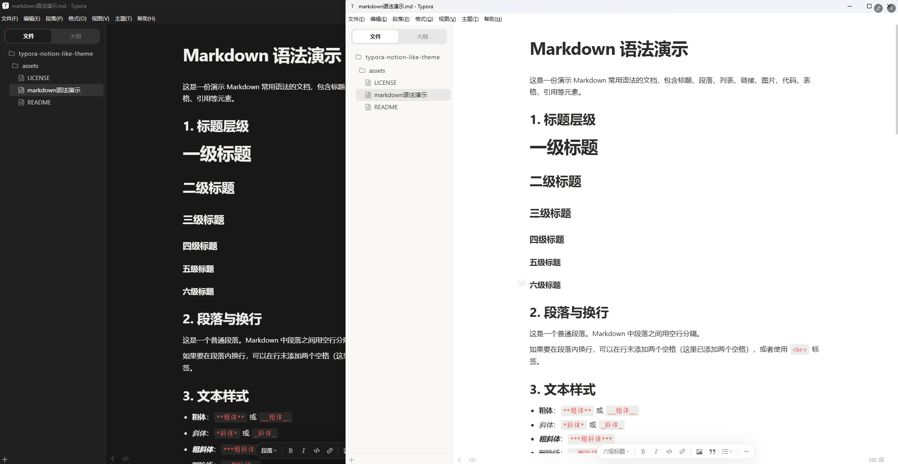
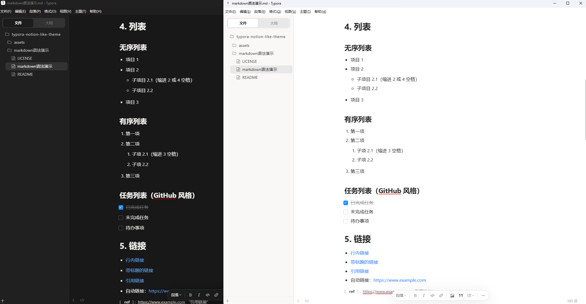
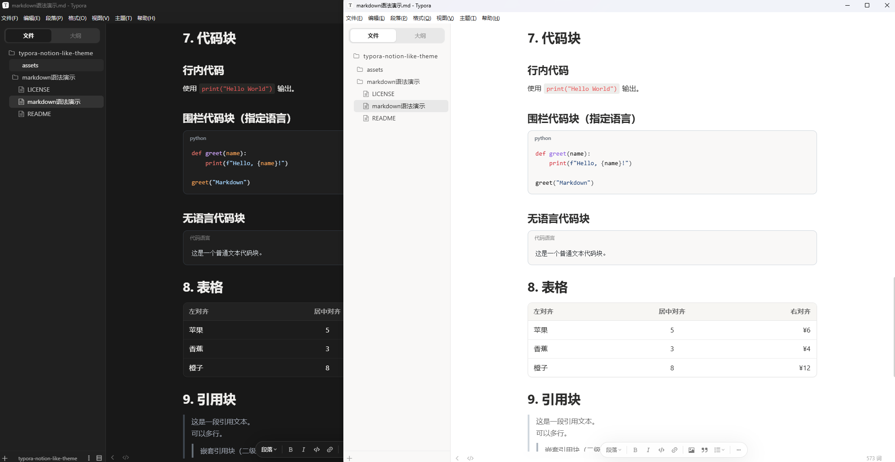

# Notion Like — Typora 主题

一套贴近 [Notion](https://www.notion.so) 阅读体验的 Typora 主题，提供浅色与深色两套样式。

## 预览

## 主题文件

| 文件 | 主题名 | 说明 |
| --- | --- | --- |
| `notion-like.css` | **Notion Like** | 浅色主题 |
| `notion-like-dark.css` | **Notion Like Dark** | 深色主题 |

## 安装

1. 下载本仓库中的 CSS 文件（可只下载需要的那一份）
2. 打开 Typora：**文件 → 偏好设置 → 外观 → 打开主题文件夹**
3. 将 CSS 文件复制到该文件夹
4. 重启 Typora（或重新打开偏好设置）
5. 在 **偏好设置 → 外观 → 主题** 中选择 **Notion Like** 或 **Notion Like Dark**

## 许可证

[MIT](LICENSE)

